# Omni

> A voice-first personal vault. Capture tasks, alarms, notes, cards and IDs by speaking — Omni sorts them, schedules them, and keeps the sensitive bits locked behind your device biometrics.

  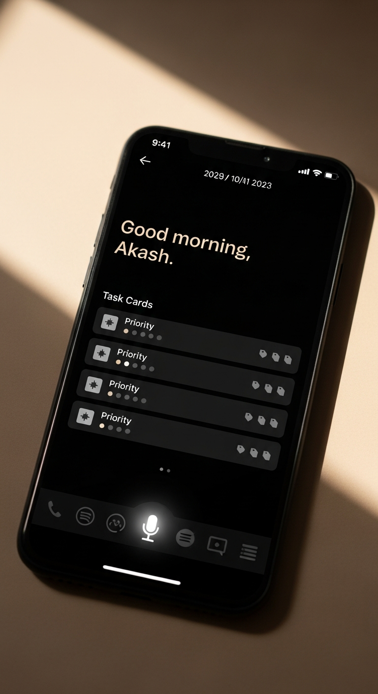

---

## What it does

Open the app, press the mic, say what's on your mind — *"call Priya at 3, set an alarm for 6:30, remind me exponential backoff caps at six."* Omni transcribes it, splits it into separate items, labels each one (task / alarm / note), and waits for you to confirm before saving.

Same app is also a private wallet. Snap a photo of a debit card, credit card, PAN, Aadhaar or driving licence; Omni runs on-device OCR, builds a virtual card with the real colours sampled from the photo, and stores the sensitive digits in the Android Keystore-backed secure store. No numbers ever leave the phone.

App opens through a biometric lock. Relocks after 15 seconds in background.

---

## Feature tour

### 1 · Home

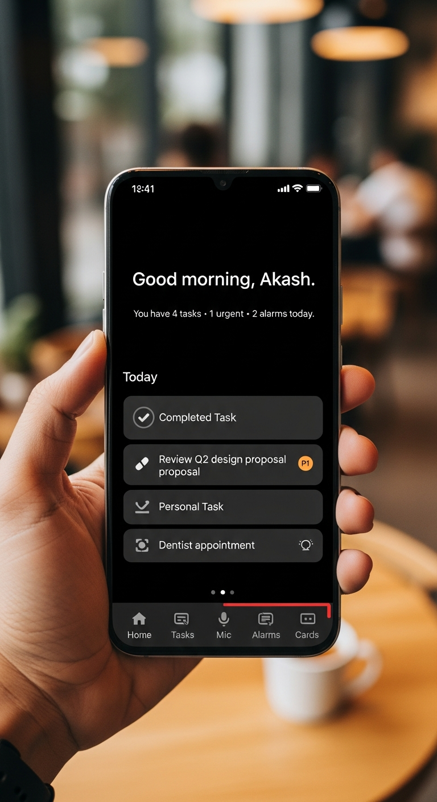

Editorial dark home. Today's open tasks, today's urgent items, today's alarms — all in one glance. Priority lane, tag chip, due time, all inline. The mic sits dead-centre in the bottom dock; tapping it opens the voice overlay.

### 2 · Voice capture

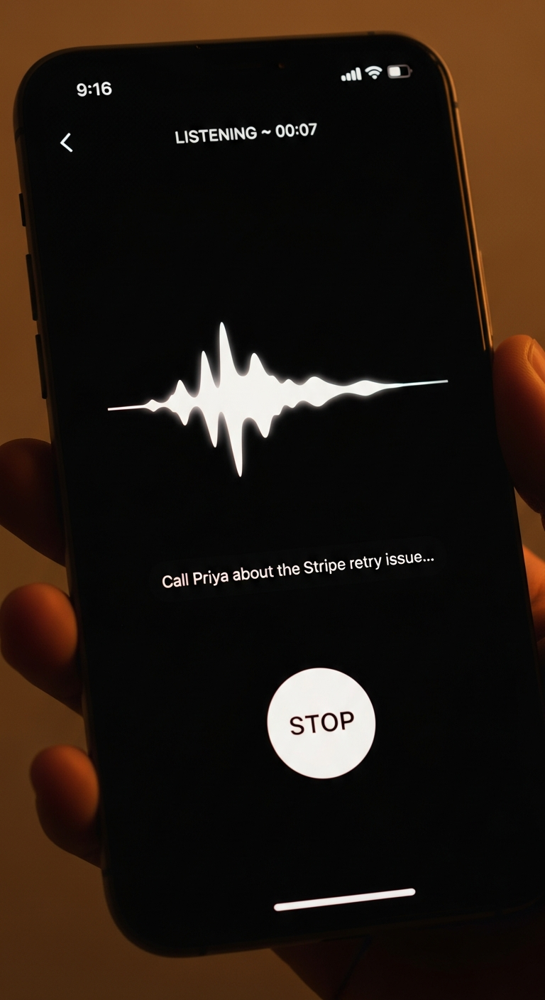

Full-screen dictation. A live waveform reacts to your voice amplitude while either the device speech recogniser or Deepgram (if the proxy is configured) streams interim transcript. Release to stop.

### 3 · AI-sorted transcript

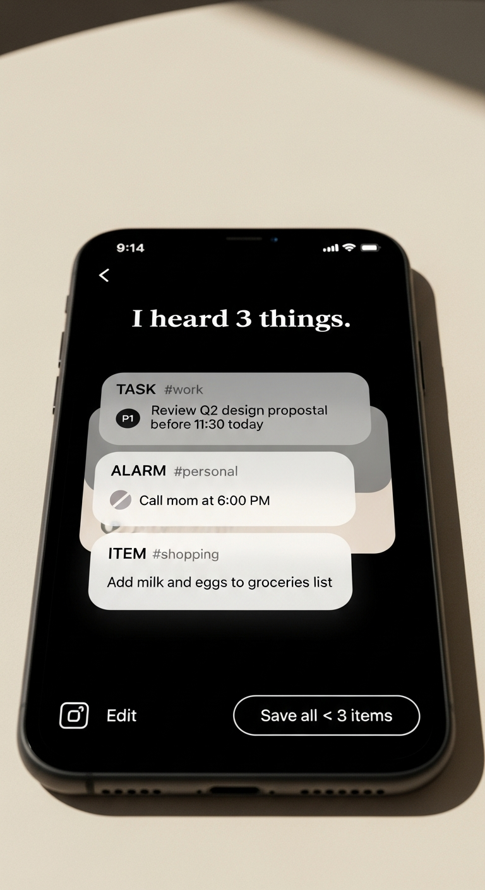

Omni splits one sentence into multiple items. A local rule-based classifier handles offline; a cloud-hosted Gemini 2.5 Flash model (through a Node proxy you own) handles the tricky ones. Each split card shows the kind (TASK / ALARM / NOTE), priority, tag, and inferred due time. Accept one, dismiss another, save the rest in one tap.

### 4 · Card stack

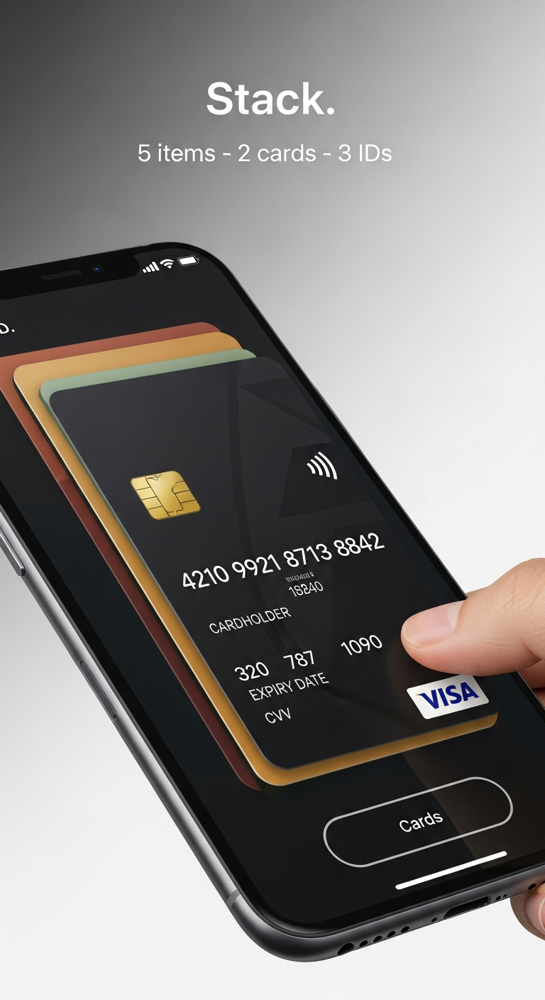

CRED-style stack. Newest card is in front; older cards peek a thin strip above. Drag down to fan them out; drag up to collapse. Tap a card to reveal its share button; tap again to hide.

### 5 · Card detail

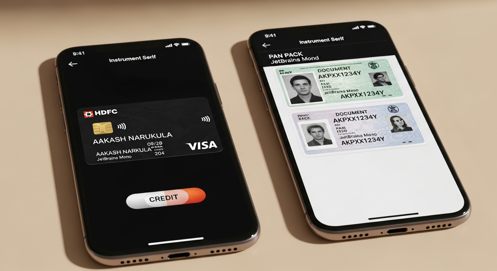

Pay cards render as virtual cards with the accent gradient sampled from the physical card photo. ID documents show the real captured photos. Full PAN, CVV and document number are loaded from the secure store only when the card is on screen; they never enter the serialised Zustand store.

### 6 · Camera capture

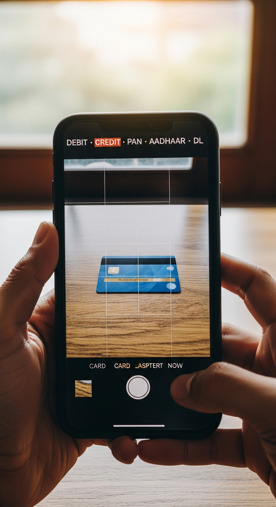

A card-aspect guide keeps the frame right. ML Kit Text Recognition runs on-device; Luhn-valid card numbers, MM/YY expiry and holder name are parsed without the image ever leaving the phone. Review screen lets you cycle card type (credit · debit · other) and brand (visa · mastercard · rupay · other) with a tap before saving.

### 7 · Manual entry

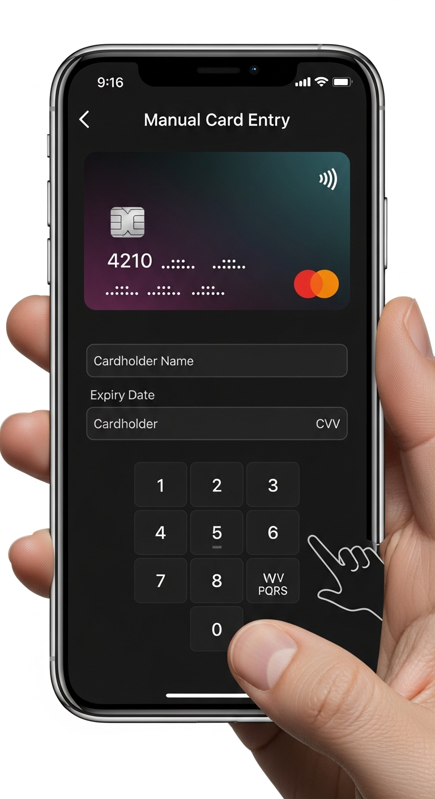

If OCR misses, the manual entry screen has a live virtual-card preview that updates as you type on the custom keypad. Validation (all required fields, Luhn optional) gates the Save Card button.

### 8 · Tasks

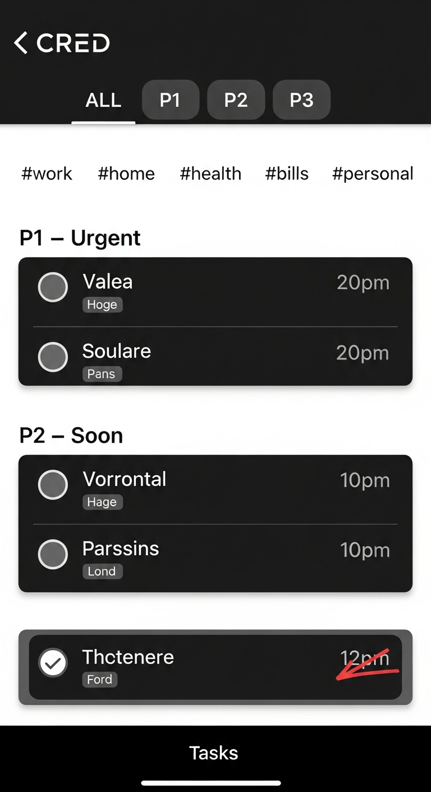

Priority lanes. Filter by P1 / P2 / P3 or by any tag chip. Strike-through on done. Long-press deletes; swipe edits.

### 9 · Alarms

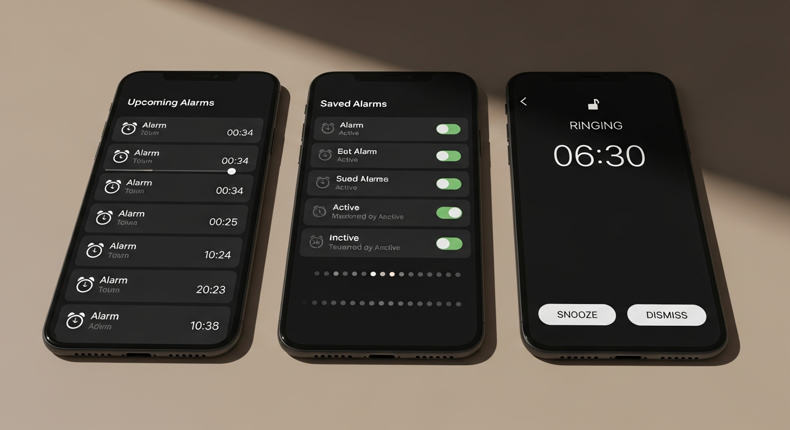

Timeline rail, clock list, and the full-screen ringing view. Alarms are armed on the device through a bundled native module that talks to the system AlarmClock so they wake the phone even when the app is closed.

### 10 · Search — Ask Omni

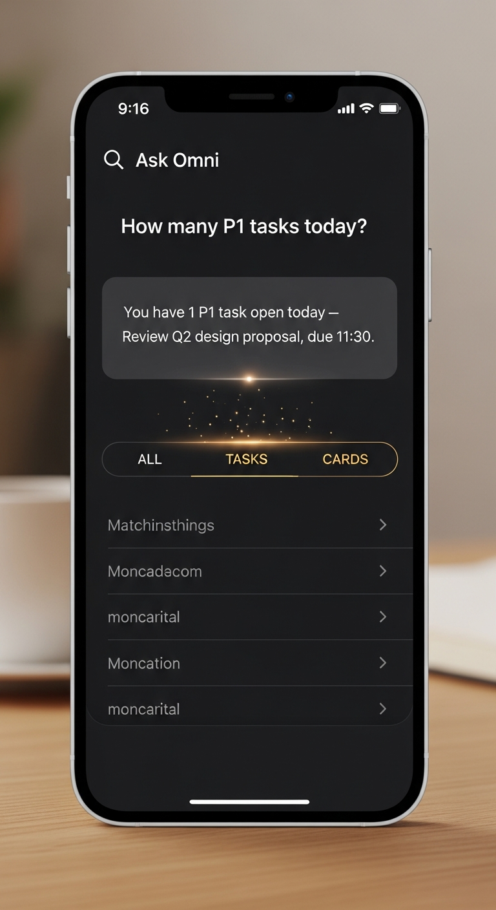

Ask Omni anything about your data in natural language. *"How many P1 tasks today?" "Show me all HDFC card uses."* The assistant answers locally by default; if the cloud proxy is configured it hands the same question to Gemini for a better reply, still on your data only.

---

## Privacy model

- **PAN, CVV, document numbers** → Android Keystore (via `expo-secure-store`, chunked)
- **Card photos, OCR** → on-device only, never uploaded
- **App lock** → biometric + device PIN fallback, 15-second background relock
- **Cloud proxy** (optional) → only receives the voice transcript text, never the images or stored cards
- **Zustand store** → also chunked into the Keystore (not AsyncStorage), so a `cat` of app data reveals nothing

Full threat model in [docs/privacy.md](docs/privacy.md).

---

## Where it runs

- **Android** — production target. Native alarm module + system biometric prompt.
- **iOS** — builds cleanly; system biometric works; alarm module is Android-only for now.
- **Web (Expo)** — renders everything except camera, OCR, biometric, secure-store and the native alarm.

---

## Docs

- [Walkthrough](docs/walkthrough.md) — every screen, every flow
- [Architecture](docs/architecture/system-overview.md) — how the pieces fit
- [Workflows](docs/workflows/) — voice → classify → commit, card capture, alarm lifecycle
- [Privacy & security](docs/privacy.md) — threat model and storage details

---

Walkthrough imagery generated with Imagen 4 on Vertex AI. Raw UI mocks at <a href="docs/assets/screens/">docs/assets/screens/</a> (rendered from the design handoff via Playwright).
