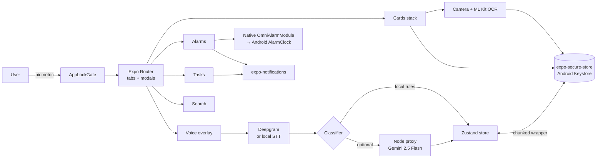

<!-- Generated by doc-superpowers | 2026-04-23 | commit: 0e59ba9 -->

# System overview

Omni is a single Expo React Native app backed optionally by a small Node proxy for AI calls. Everything sensitive stays on the device.



## Components

| Layer | What | Where |
| ----- | ---- | ----- |
| UI shell | Expo Router, dark theme, font loader, splash hold, lock gate | `app/_layout.tsx`, `components/AppLockGate.tsx` |
| Tabs | Tasks · Alarms · Cards (+ hidden Home overlay) | `app/(tabs)/` |
| Modals | Voice, Transcribe, Search, Camera, Confirm, Assistant, Alarms/ringing | `app/*.tsx`, `app/camera/`, `app/alarms/ringing.tsx` |
| State | Zustand with chunked-Keystore-backed `persist` middleware | `store/index.ts`, `services/secure-storage.ts` |
| Voice | STT handle (mock or Deepgram); rule-based local classifier; optional cloud classifier | `services/ai.ts`, `services/classify.ts` |
| Cards | Capture → OCR → review → save; virtual card render; share as PNG + metadata | `app/camera/*.tsx`, `services/ocr.ts`, `components/VirtualCard.tsx` |
| Alarms | System alarms via native module; pre-warn notifications via expo-notifications | `services/alarms.ts`, `services/notify.ts`, `android/app/src/main/.../OmniAlarmModule.kt` |
| Secure wallet | PAN / CVV / document number in `expo-secure-store` | `services/secure.ts` |
| Assistant / search | Local topic + keyword search; optional cloud answer via proxy | `services/assistant.ts`, `services/ai.ts` |
| Destructive commands | Voice → parse → confirm → execute (delete across entities) | `services/command.ts` |

## Data flow summary

**Voice capture → store**
```
mic → STT (deepgram or local) → transcript
    → classifier (rules, or Gemini via proxy) → ClassifiedItem[]
    → user approves on the transcribe screen
    → commitClassifications() writes tasks/alarms/notes into Zustand
    → notify.ts resyncs all local notifications
    → alarms.ts arms system AlarmClock for any new ALARM
```

**Card capture → store**
```
camera → photo file (app-private) → ML Kit OCR → draft fields
    → user edits + cycles type/brand on review screen
    → saveSecret(card_<id>_pan), saveSecret(card_<id>_cvv)
    → addCard() writes non-sensitive fields + last4 into Zustand
    → store persist() writes through chunked wrapper into SecureStore
```

**Persistence**

Everything in the Zustand `partialize` allowlist (tasks / alarms / reminders / cards / docs / notes / queued / taskFilter) is chunked into 1800-byte pieces and stored as `omni-store__0`, `omni-store__1`, … in `expo-secure-store`. On boot, chunks are reassembled and JSON-parsed back into Zustand state. Secrets (PAN / CVV / document number) live as separate SecureStore entries; they are never serialised into the Zustand snapshot.

## Platforms

- **Android** — production target. Native alarm module, biometric + device PIN, Keystore-backed secure store.
- **iOS** — builds and runs; biometric works; alarm module is Android-only for now.
- **Web (Expo)** — UI renders, but camera / OCR / biometric / secure-store / native alarm are all no-ops or absent.
