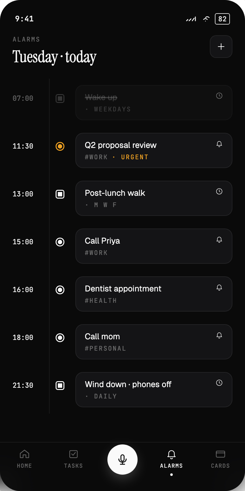
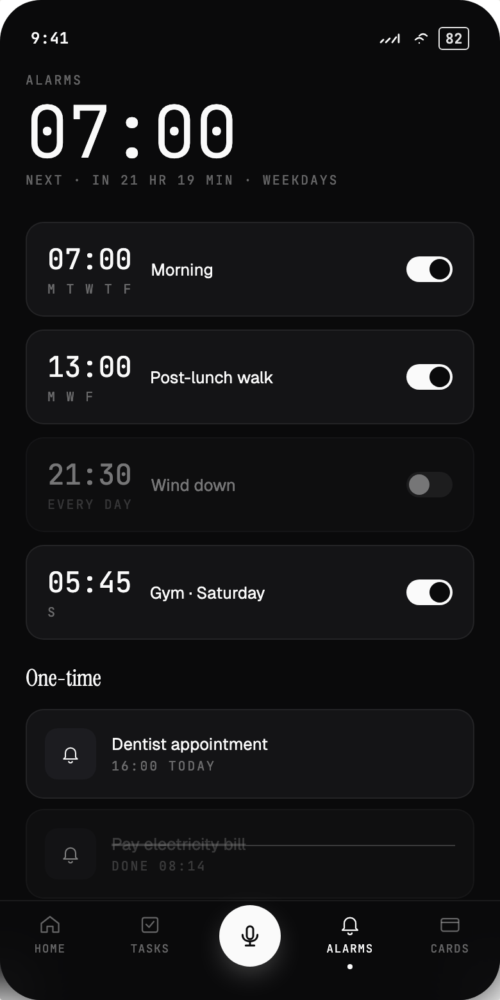
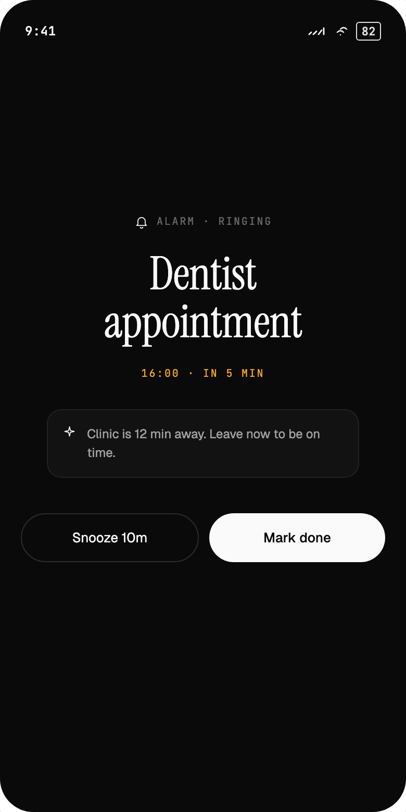
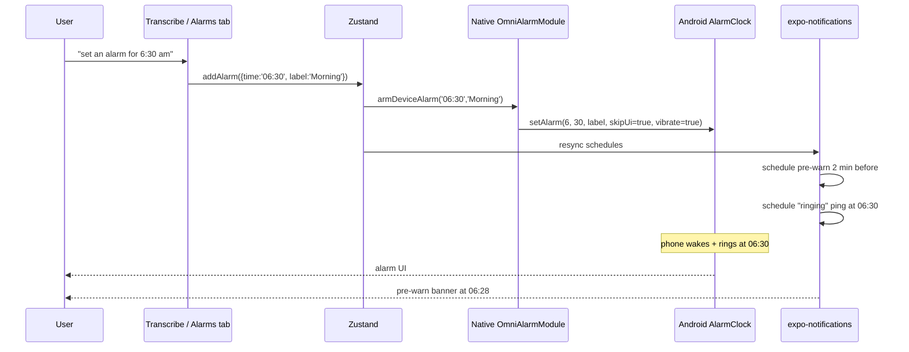

<!-- Generated by doc-superpowers | 2026-04-23 | commit: 0e59ba9 -->

# Alarm lifecycle

  
  
  

Alarms in Omni are real phone alarms — they ring even when Omni is killed, because they go through the Android system `AlarmClock` intent, not through an in-app timer.

## Phases

## States an alarm can be in

| State | `enabled` | In Zustand? | System AlarmClock? | Notifications? |
| ----- | --------- | ----------- | ------------------ | -------------- |
| Armed one-time | `true` | yes | set for next HH:MM | pre-warn + at-time |
| Armed recurring | `true` | yes, with `days[]` | set for next matching weekday | same |
| Disabled | `false` | yes | — | — |
| Native module missing | `false` (saved but not armed) | yes | — | — |
| Dismissed | `false` (same row, flag flipped) | yes | — | — |

## Recurring alarms

`days[]` is a subset of `['M','T','W','Th','F','Sa','Su']`. The native module takes Calendar-style day numbers (1 = Sunday), so `services/alarms.ts` maps through `DAY_TO_CALENDAR` before calling `setAlarm`. The scheduler in `notify.ts` finds the next occurrence within an 8-day window so a Monday alarm set on Sunday evening shows up correctly in the timeline.

## Re-entry

Because the actual alarm lives in the system clock, Omni can be killed or crash and the alarm still rings. On the next app open, the `Alarms` tab lists the same row with the next HH:MM that will fire; the user sees it as continuous.
