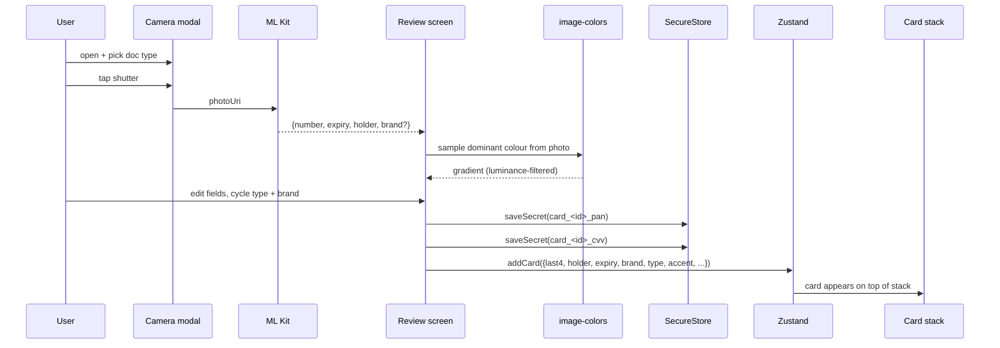

<!-- Generated by doc-superpowers | 2026-04-23 | commit: 0e59ba9 -->

# Card capture → secure vault

  
  
  

Snap a card → OCR on device → review → save. The photo and every sensitive digit stay on the phone.

## Phases

## Why a review step

OCR isn't perfect. A glare on the last four digits or a poor light on the holder name can corrupt a field, and silently saving a mis-parsed PAN leads to failed transactions later. The review step is mandatory. The **Save Card** button only becomes active once every required field is valid (Luhn-valid PAN digits, `MM/YY` expiry, 3–4 digit CVV, non-empty holder and bank).

## Accent colour extraction

`react-native-image-colors` returns `lightVibrant` / `darkVibrant` / `dominant`. The review screen prefers the first colour whose luminance (WCAG Rec.709) exceeds 0.18, so a blurry low-light capture doesn't turn the virtual card black. If nothing qualifies, it falls back to the brand palette.

## Storage

| Field | Where |
| ----- | ----- |
| PAN (full digits) | `card_<id>_pan` in SecureStore |
| CVV | `card_<id>_cvv` in SecureStore |
| Holder, expiry, last4, brand, type, accent gradient | Zustand (chunked, Keystore-backed) |
| Issuer, network, lastUsed, limitHint | Zustand |
| Photo | app-private filesystem (photo URI in Zustand) |

When a saved card is opened in the stack, the `VirtualCard` component re-reads PAN and CVV from SecureStore on mount — they never live in JS memory longer than they need to.
