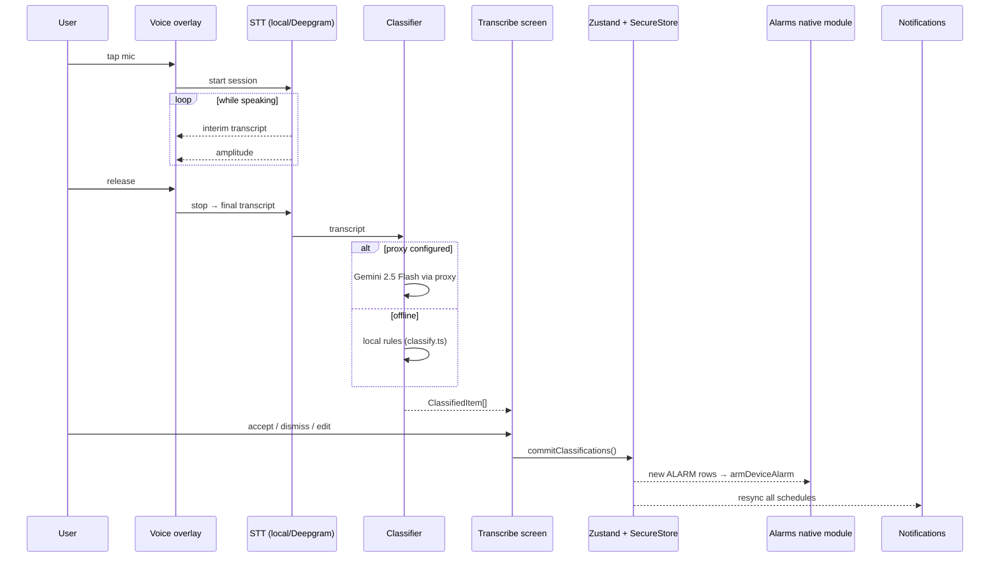

<!-- Generated by doc-superpowers | 2026-04-23 | commit: 0e59ba9 -->

# Voice → tasks / alarms / notes

  
  

The flagship flow. One voice memo becomes many committed items.

## Phases

## Classifier behaviour

- **ALARM** detected if the phrase matches `alarm / wake me / set a timer` AND a parseable time is present. If the intent is clear but the time is not, it falls back to a TASK so the user isn't silently scheduled for 08:00.
- **TASK** detected on reminder-style phrasing (`remind me`, `don't forget to`) or imperative verbs (`call / pay / book / …`). Priority is inferred (`urgent` / `asap` → P1; `soon` / `today` → P2) and a tag is inferred from keyword matches (`work`, `bills`, `health`, `home`).
- **NOTE** detected on note-tagging phrasing (`note:`, `save a note`, `remember that`, `fyi`).
- Anything else defaults to a TASK with confidence scaled by signal strength.

## Commit rules

- New TASK → prepended to the tasks list with `done: false`, using the detected priority/tag/due.
- New ALARM → calls the native module to arm the system alarm at the detected HH:MM. If the call fails (module missing, user denied permission), the alarm is still saved with `enabled: false` so the user can retry.
- New NOTE → prepended to notes with a timestamp.
- After commit, `notify.ts` cancels all scheduled notifications and re-emits the full plan (task-due pings, P1 morning nudges, alarm pre-warns, reminder pings).
